
# ¿Qué es Amazon EC2?

Amazon Elastic Compute Cloud (Amazon EC2) proporciona capacidad de computación escalable en la nube de Amazon Web Services (AWS). El uso de Amazon EC2 elimina la necesidad de invertir inicialmente en hardware, de manera que puede desarrollar e implementar aplicaciones en menos tiempo. 

# ¿Para que sirve?
Se puede usar Amazon EC2 para lanzar tantos servidores virtuales como necesite, configurar la seguridad y las redes y administrar el almacenamiento.

# Documentación

Primero empezaremos a lanzar una instancia.

Le daremos a free tier y después descargaremos la última versión de el servidor- Ubuntu.

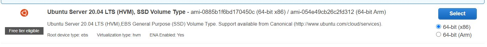

Elegimos un tipo de instancia y le damos a siguiente:

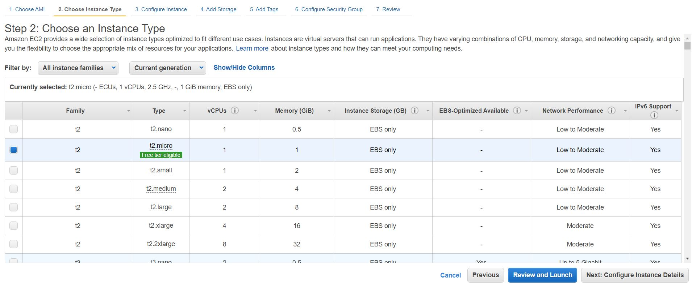

Esta página es para configurar las instancias, dejamos como están y damos a siguiente.

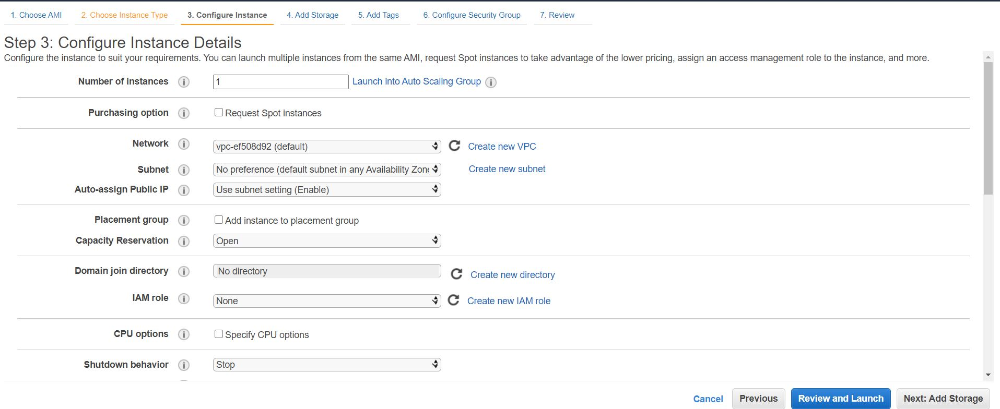

Vamos a añadir 30GB de almacenamiento, que es el máximo permitido, así sacaremos el máximo rendimiento de manera gratuita.

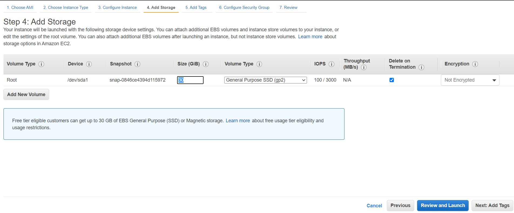

Seguimos y daremos a next.

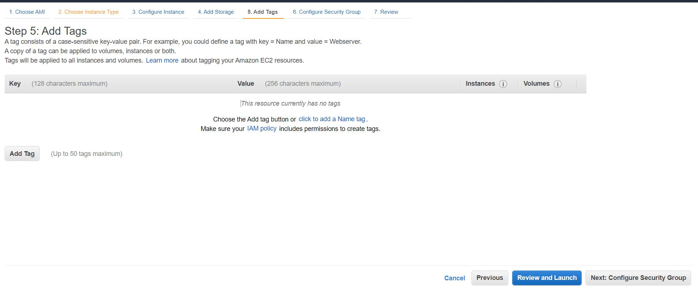

En la configuración de seguridad de grupo, el tipo será de SSH, protocolo TCP y puerto 22. 

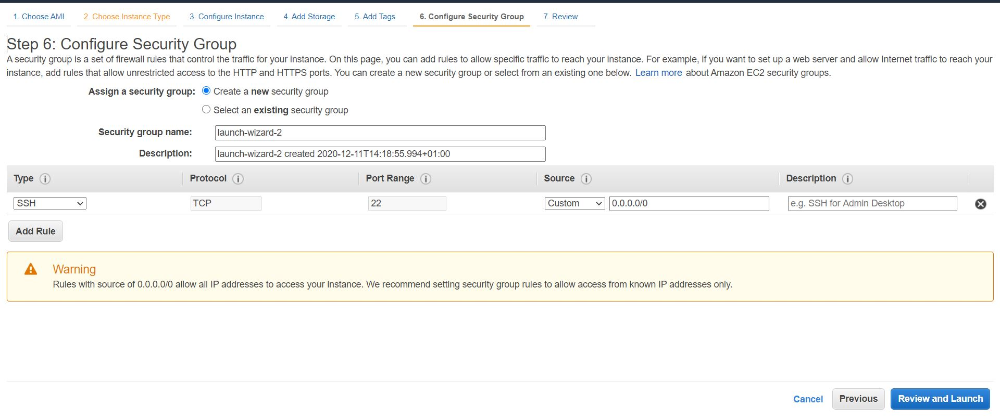

Revisamos si esta todo correcto y le damos a launch.

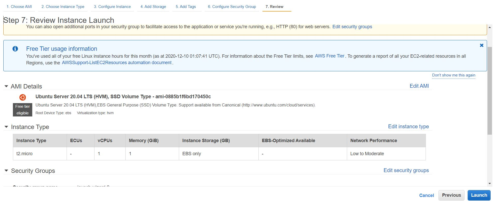

En esta ventana tendremos la opción de crear una llave o escoger una existente, en mi caso creare una nueva y llamaré clave2. Esta key tendremos que guardar en un sitio seguro, ya que luego la necesitaremos.

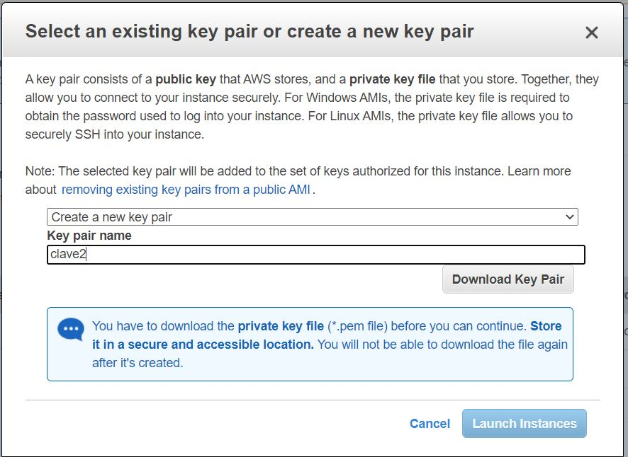

Le damos a next:

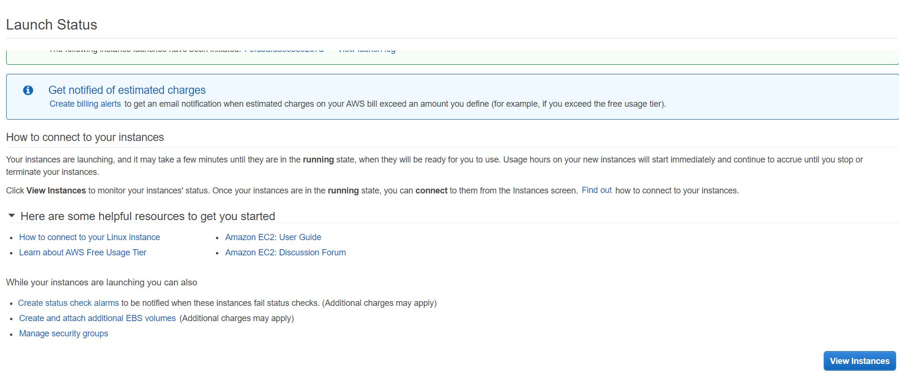

Se nos descargará la key, el tipo de archivo será ".pem".

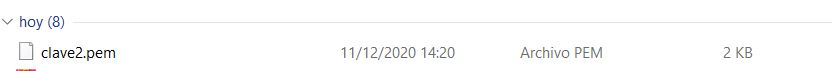

Como podemos ver, se nos ha creado la instancia. Por el momento tenemos detenida.

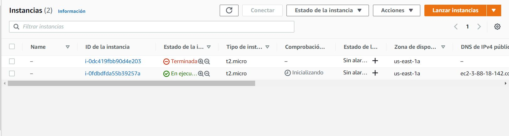

Para conectar la instancia, daremos al botón de acciones y damos a conectar.

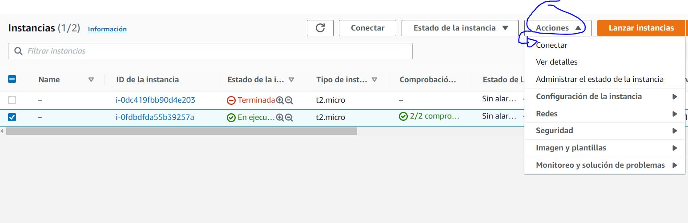

Ahora tendremos que darle permisos y ejecutar nuestro DNS público para conectarse a la instancia.

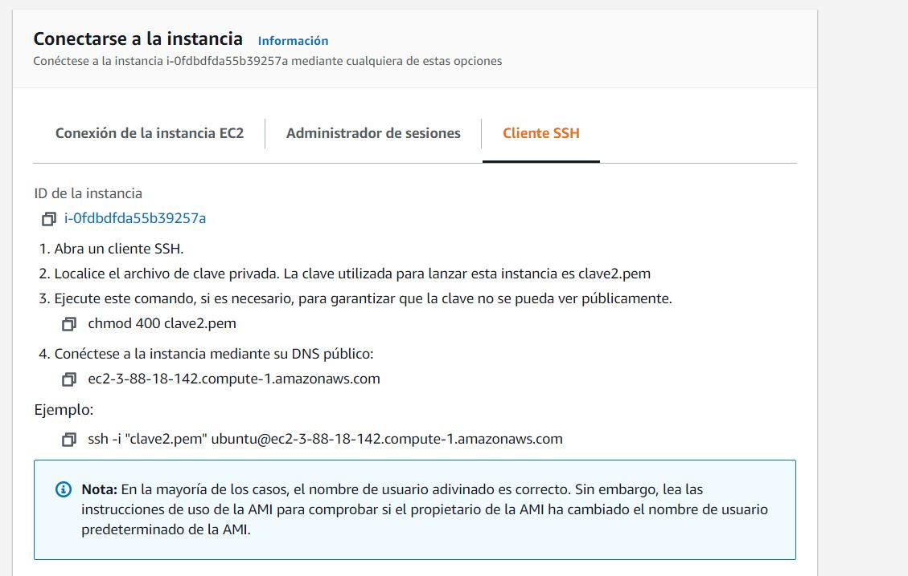

Hacemos un Git bash en la carpeta donde tenemos guardada la Key, copiamos los permisos y nuestro DNS público. Le daremos a yes:

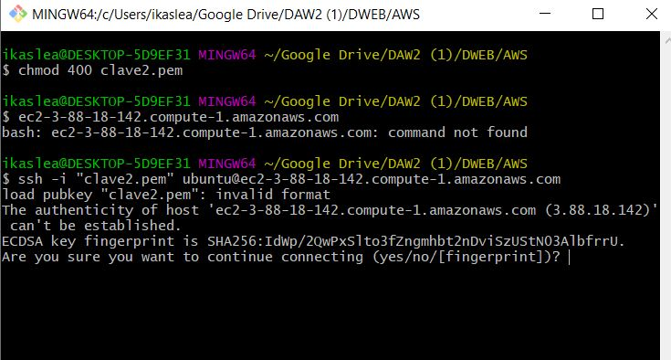

Ya estaríamos conectados a la instancia. Podemos comprobar en la página de AWS.

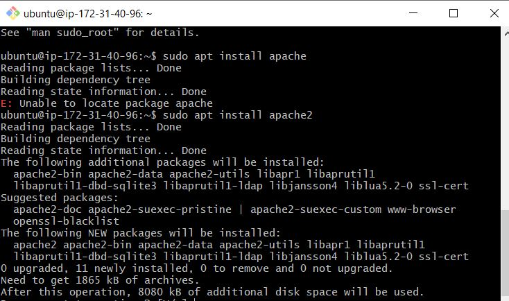

Como podemos ver, ya estaríamos conectados a la instancia.

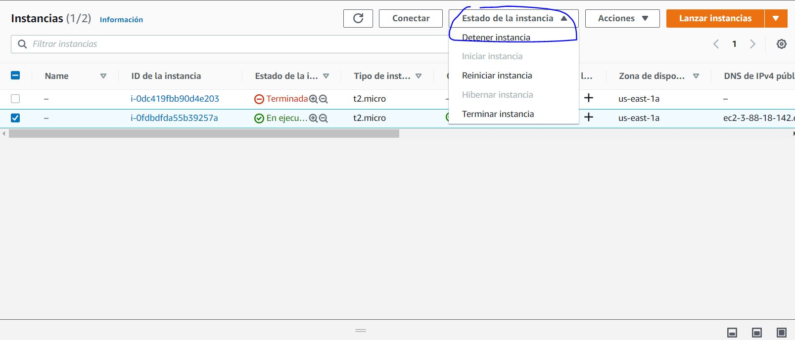

Para detener la instancia, le daremos al botón de acciones y le damos a detener instancia.

# Instalacion de APACHE2, MYSQL, PHP Y FTP.

Primero tenemos que abrir una consola donde tengamos nuestra clave privada y darle permisos: chmod 400 clave2.pem.

Despues nos conectaremos mediante SSH: ssh -i "clave2.pem" ubuntu@ec2-52-55-225-137.compute-1.amazonaws.com

Una vez conectados instalaremos lo siguiente:

## Índice de contenidos

* [Instalar Apache2](#item1)
* [Instalar MySQL](#item2)
* [Instalar PHP](#item3)
* [Instalar FTP](#item4)

# Instalar Apache2

Antes que nada haremos un update:  sudo apt-get update

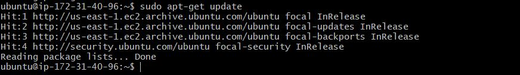

Y ahora instalaremos apache. sudo apt-get install apache2

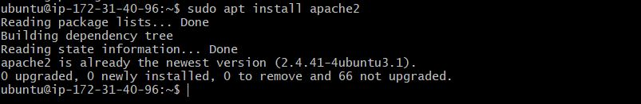

Para comprobar que funciona correctamente primero accederemos al **wizard de AWS** para comprobar que HTTP y HTTPS están habilitados:

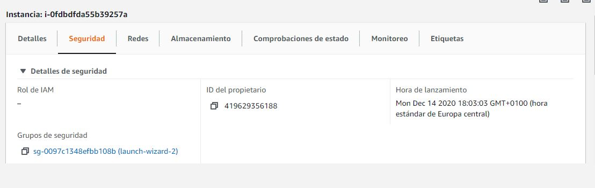

Una vez aquí clickaremos en Edit:

Para acabar, con Add rule añadiremos una regla nueva donde seleccionaremos HTTP en la sección de tipo. Repite este paso para añadir HTTPS:
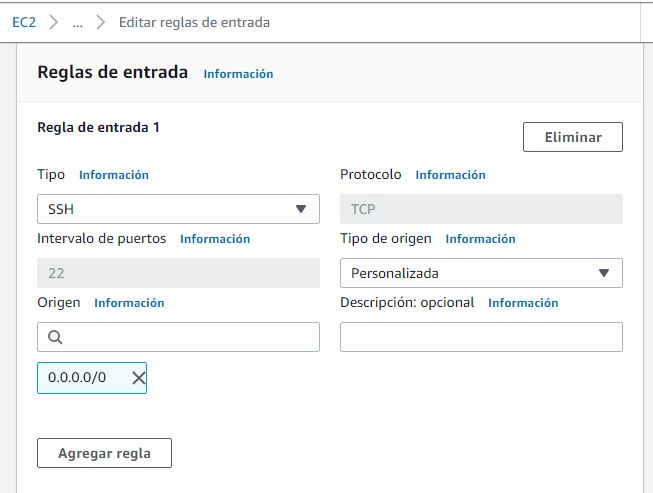

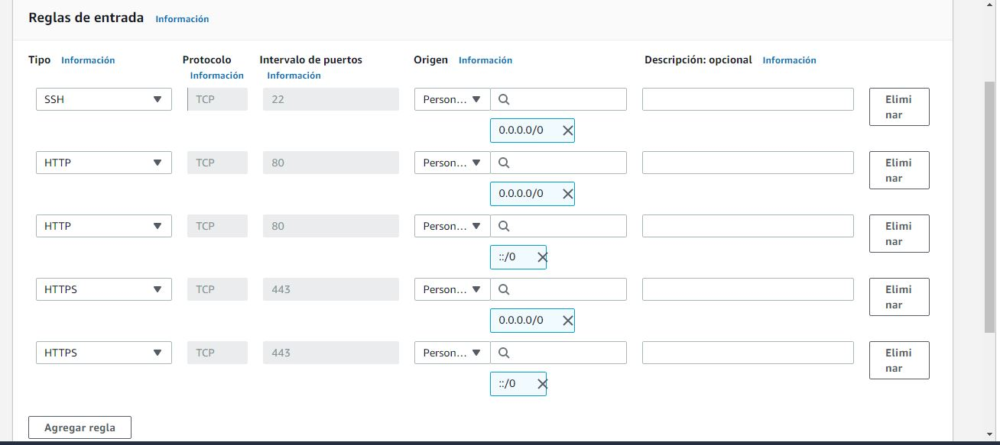

Ahora ya podemos comprobar si la instalación del Apache2 se ha hecho de manera correcta, para ello escribe lo siguiente en tu navegador:

http://ip_de_tu_servidor o http://dns_de_tu_servidor

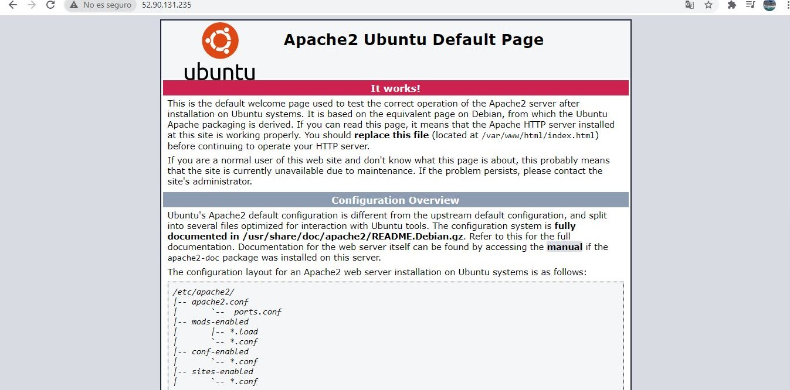

Puedes encontrar tu ip o dns en esta sección una vez que la máquina está encendida:

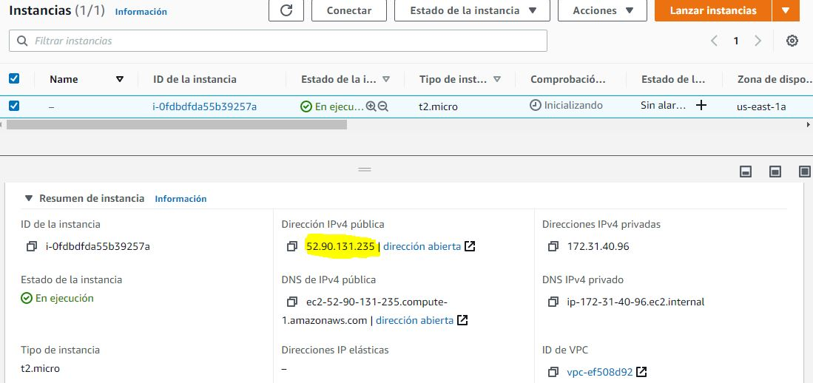

[Subir](#top)

# Instalar MySQL

Instalaremos MySQL, para ello usaremos este comando: 

sudo apt-get install mysql-server mysql-client

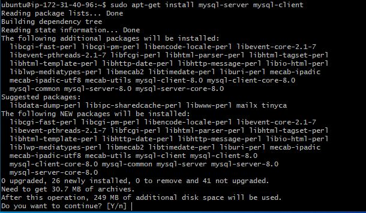

Con este comando instalaremos tanto el servidor como el cliente de MySQL.

Al finalizar la instalación ejecutaremos el siguiente comando:

sudo mysql_secure_installation

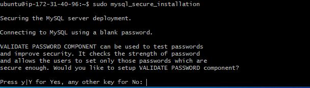

Con este comando borraremos algunos parametros peligrosos y aseguraremos el acceso ala base de datos.

Después te pedirá que completes unos pasos. Hazlo de la siguiente manera:

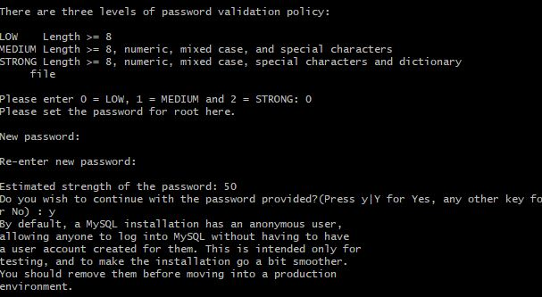

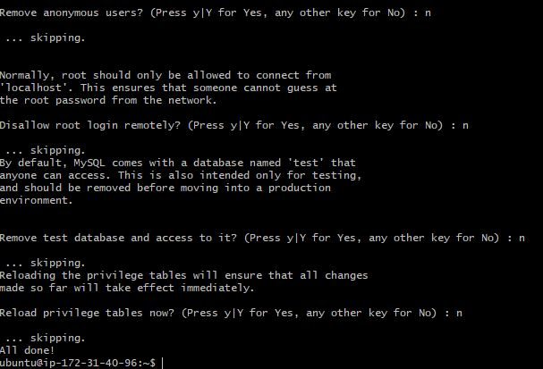

Si quisieras comprobar tu versión de MySQL puedes hacerlo con esté comando:

mysql --version

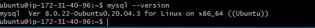

[Subir](#top)

# Instalar PHP

Ahora toca instalar PHP, para ello comenzaremos con el comando de instalación de nuevo:

sudo apt install php libapache2-mod-php php-mysql

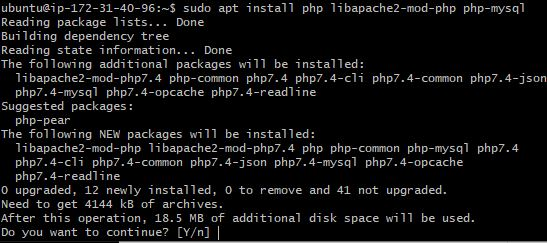

Si tus archivos van a ser de tipo .php es recomendable que modifiques el archivo dir.conf para dar prioridad a dicho tipo de archivos.

Para conseguir esto ejecutaremos el siguiente comando:

sudo nano /etc/apache2/mods-enabled/dir.conf

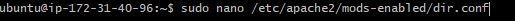

Con esto te saldra algo como esto:

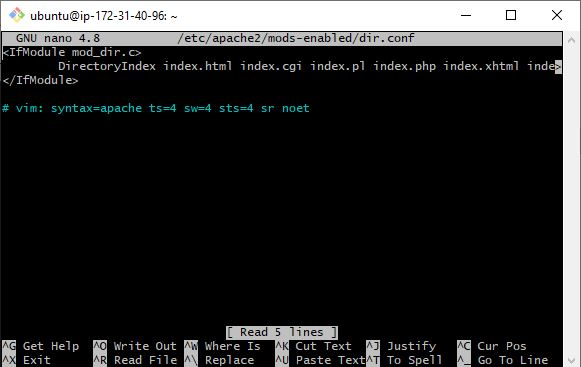

Cambiaremos de sitio el archivo index.php colocándolo en primer lugar y lo guardaremos con Ctrl+o y saldremos con Ctrl+x:

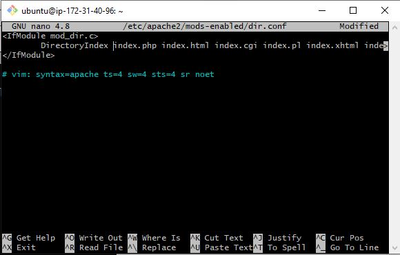

Seguidamente reiniciaremos el servicio de Apache2 para que los cambios se efectuen:

sudo systemctl restart apache2

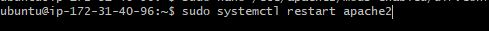

Una vez reiniciado comprobaremos el estado del servicio con este otro comando:

Ahora comprobaremos que estos cambios son eficaces. Para esto, crearemos un archivo de tipo .php, el mas útil de ellos es info.php:

sudo nano /var/www/html/info.php

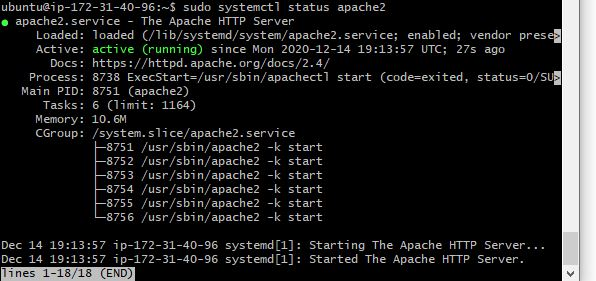

Esto creará una página en blanco donde escribiremos el siguiente código:

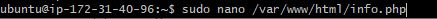

Cuando acabes guarda el archivo con Ctrl+o y sal de el con Ctrl+x.

Ahora podremos ver ese archivo en nuestro navegador escribiendo lo siguiente:

http://ip_de_tu_servidor/info.php o http://dns_de_tu_servidor/info.php

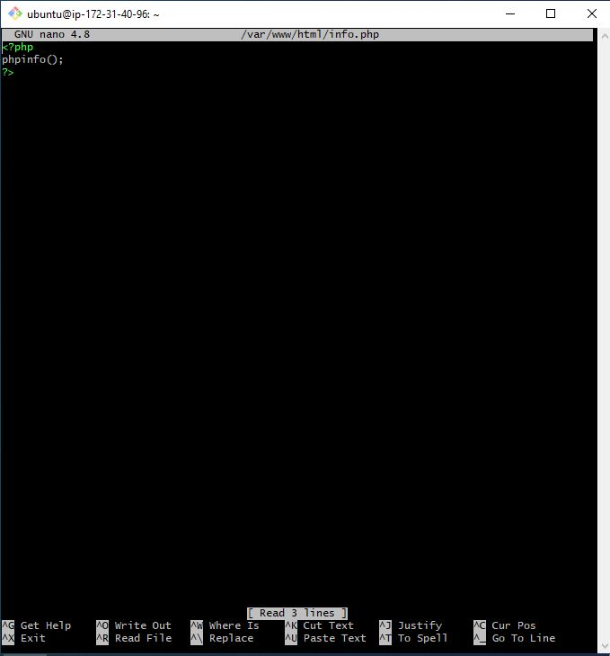

[Subir](#top)

# Instalar FTP
Vamos a instalar el servidor FTP
[Subir](#top)