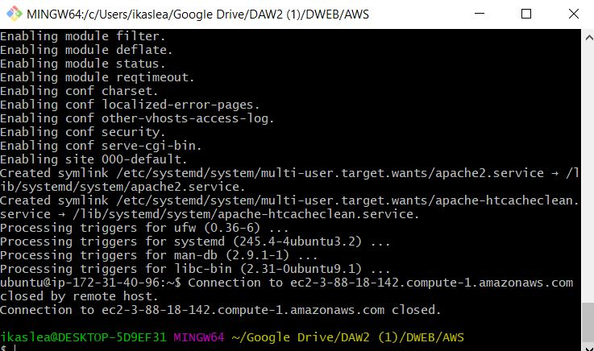
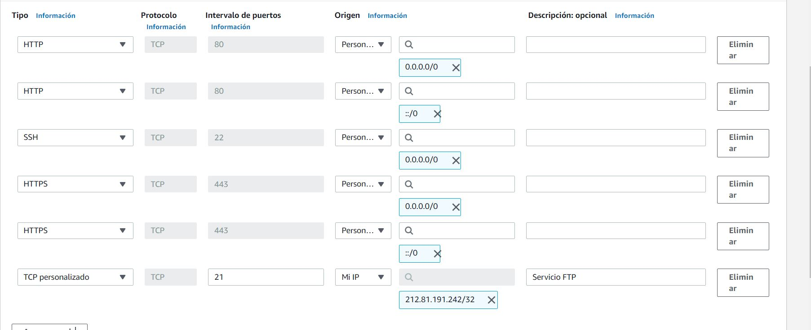

# ¿Qué es Amazon EC2?

Amazon Elastic Compute Cloud (Amazon EC2) proporciona capacidad de computación escalable en la nube de Amazon Web Services (AWS). El uso de Amazon EC2 elimina la necesidad de invertir inicialmente en hardware, de manera que puede desarrollar e implementar aplicaciones en menos tiempo. 

# ¿Para que sirve?
Se puede usar Amazon EC2 para lanzar tantos servidores virtuales como necesite, configurar la seguridad y las redes y administrar el almacenamiento.

# Documentación

Primero empezaremos a lanzar una instancia.

Le daremos a free tier y después descargaremos la última versión de el servidor- Ubuntu.

Elegimos un tipo de instancia y le damos a siguiente:

Esta página es para configurar las instancias, dejamos como están y damos a siguiente.

Vamos a añadir 30GB de almacenamiento, que es el máximo permitido, así sacaremos el máximo rendimiento de manera gratuita.

Seguimos y daremos a next.

En la configuración de seguridad de grupo, el tipo será de SSH, protocolo TCP y puerto 22. 

Revisamos si esta todo correcto y le damos a launch.

En esta ventana tendremos la opción de crear una llave o escoger una existente, en mi caso creare una nueva y llamaré clave2. Esta key tendremos que guardar en un sitio seguro, ya que luego la necesitaremos.

Le damos a next:

Se nos descargará la key, el tipo de archivo será ".pem".

Como podemos ver, se nos ha creado la instancia. Por el momento tenemos detenida.

Para conectar la instancia, daremos al botón de acciones y damos a conectar.

Ahora tendremos que darle permisos y ejecutar nuestro DNS público para conectarse a la instancia.

Hacemos un Git bash en la carpeta donde tenemos guardada la Key, copiamos los permisos y nuestro DNS público. Le daremos a yes:

Ya estaríamos conectados a la instancia. Podemos comprobar en la página de AWS.

Como podemos ver, ya estaríamos conectados a la instancia.

Para detener la instancia, le daremos al botón de acciones y le damos a detener instancia.

# Instalacion de APACHE2, MYSQL, PHP Y FTP.

Primero tenemos que abrir una consola donde tengamos nuestra clave privada y darle permisos: chmod 400 clave2.pem.

Despues nos conectaremos mediante SSH: ssh -i "clave2.pem" ubuntu@ec2-52-55-225-137.compute-1.amazonaws.com

Una vez conectados instalaremos lo siguiente:

## Índice de contenidos

* [Instalar Apache2](#item1)
* [Instalar MySQL](#item2)
* [Instalar PHP](#item3)
* [Instalar FTP](#item4)

# Instalar Apache2

Antes que nada haremos un update con el siguiente comando: 

<code> sudo apt-get update</code>

Y ahora instalaremos apache con el sigueinte comando:

<code>sudo apt-get install apache2</code>

Para comprobar que funciona correctamente primero accederemos al **wizard de AWS** para comprobar que HTTP y HTTPS están habilitados:

Una vez aquí clickaremos en Edit:

Para acabar, con Add rule añadiremos una regla nueva donde seleccionaremos HTTP en la sección de tipo. Repite este paso para añadir HTTPS:

Ahora ya podemos comprobar si la instalación del Apache2 se ha hecho de manera correcta, para ello escribe lo siguiente en tu navegador:

<code>http://ip_de_tu_servidor o http://dns_de_tu_servidor</code>

Puedes encontrar tu ip o dns en esta sección una vez que la máquina está encendida:

# Instalar MySQL

Instalaremos MySQL, para ello usaremos este comando: 

<code>sudo apt-get install mysql-server mysql-client</code>

Con este comando instalaremos tanto el servidor como el cliente de MySQL.

Al finalizar la instalación ejecutaremos el siguiente comando:

<code>sudo mysql_secure_installation</code>

Con este comando borraremos algunos parametros peligrosos y aseguraremos el acceso ala base de datos.

Después te pedirá que completes unos pasos. Hazlo de la siguiente manera:

Si quisieramos comprobar tu versión de MySQL puedes hacerlo con esté comando:

<code>mysql --version</code>

# Instalar PHP

Ahora toca instalar PHP, para ello comenzaremos con el comando de instalación de nuevo:

<code>sudo apt install php libapache2-mod-php php-mysql</code>

Si tus archivos van a ser de tipo .php es recomendable que modifiques el archivo dir.conf para dar prioridad a dicho tipo de archivos.

Para conseguir esto ejecutaremos el siguiente comando:

<code>sudo nano /etc/apache2/mods-enabled/dir.conf</code>

Con esto te saldra algo como esto:

Cambiaremos de sitio el archivo index.php colocándolo en primer lugar y lo guardaremos con Ctrl+o y saldremos con Ctrl+x:

Seguidamente reiniciaremos el servicio de Apache2 para que los cambios se efectuen:

<code>sudo systemctl restart apache2</code>

Una vez reiniciado comprobaremos el estado del servicio con este otro comando:

Ahora comprobaremos que estos cambios son eficaces. Para esto, crearemos un archivo de tipo .php, el mas útil de ellos es info.php:

<code>sudo nano /var/www/html/info.php</code>

Esto creará una página en blanco donde escribiremos el siguiente código:

Cuando acabes guarda el archivo con Ctrl+o y sal de el con Ctrl+x.

Ahora podremos ver ese archivo en nuestro navegador escribiendo lo siguiente:

<code>http://ip_de_tu_servidor/info.php o http://dns_de_tu_servidor/info.php</code>

# Instalar FTP

Primero vamos a crear 3 usuarios cliente, servidor y administrador para eso meteromos el siguiente comando.

<code> sudo adduser cliente</code>

<code> sudo adduser servidor</code>

<code> sudo adduser administrador</code>

Ahora instalaremos el servidor FTP, para ello meteremos el siguiente comando:

<code>sudo apt-get install vsftpd</code>

Una vez que haya instalado el paquete, puede ejecutar el servicio y habilitarlo para que se ejecute al iniciar el sistema.

<code>sudo systemctl start vsftpd
sudo systemctl enable vsftpd</code>

Ahora habilitaremos el puerto 21 para el servicio FTP:

Por lo ultimo reseteamos el servicio FTP con el sigiente comando

<code>sudo service vsftpd restart</code>

# Direcciones IP elásticas

Las direcciones IP elásticas son direcciones IPv4 estáticas diseñadas para la informática en la nube dinámica.

# ¿Para que sirve?

Con una dirección IP elástica, puede enmascarar los errores de una instancia o software volviendo a mapear rápidamente la dirección a otra instancia de su cuenta. Se asigna una dirección IP elástica a su cuenta de AWS, que es suya hasta que la libere.

# Documentación

Para asignar una dirección IP elástica desde un grupo de direcciones IPv4 públicas de Amazon utilizando la consola:

- Abra la consola de Amazon EC2 en https:// console.aws.amazon.com/ec2/.

- En el panel de navegación, elija Elastic IPs (Direcciones IP elásticas).

- Elija Allocate new address (Asignar nueva dirección).

En IPv4 address pool (Grupo de direcciones IPv4), elija Amazon pool (Grupo de Amazon).

Elija Allocate (Asignar) y cierre la pantalla de confirmación.

Aquí sale un resumen de nuestra IP alocada:

[Subir](#top)

# DNS

Los registros DNS son diferentes cadenas de letras que se utilizan para indicar ciertas acciones al servidor DNS. Estas letras también son conocidas como sintaxis de DNS.

# ¿Para que sirve?

Los DNS sirven para indicarle al usuario que teclea un dominio a que servidor debe ir a recoger la página web que desea consultar.

# Tipos de DNS

Los tipos de registros más utilizados son:

- A = Dirección (address). Este registro se usa para traducir nombres de servidores de alojamiento a direcciones IPv4.
- AAAA = Dirección (address). Este registro se usa en IPv6 para traducir nombres de hosts a direcciones IPv6.
CNAME = Nombre canónico (canonical Name). Se usa para crear nombres de servidores de alojamiento adicionales, o alias, para los servidores de alojamiento de un dominio. Es usado cuando se están corriendo múltiples servicios (como FTP y servidor web) en un servidor con una sola dirección IP. Cada servicio tiene su propia entrada de DNS (como ftp.ejemplo.com. y www.ejemplo.com.). Esto también es usado cuando corres múltiples servidores HTTP, con diferentes nombres, sobre el mismo host. Se escribe primero el alias y luego el nombre real. Ej. Ejemplo1 IN CNAME ejemplo2
- NS = Servidor de nombres (name server). Define la asociación que existe entre un nombre de dominio y los servidores de nombres que almacenan la información de dicho dominio. Cada dominio se puede asociar a una cantidad cualquiera de servidores de nombres.
- MX = Intercambio de correo (mail exchange). Asocia un nombre de dominio a una lista de servidores de intercambio de correo para ese dominio. Tiene un balanceo de carga y prioridad para el uso de uno o más servicios de correo.
PTR = Indicador (pointer). También conocido como 'registro inverso', funciona a la inversa del registro A, traduciendo IPs en nombres de dominio. Se usa en el archivo de configuración de la zona DNS inversa.
- SOA = Autoridad de la zona (start of authority). Proporciona información sobre el servidor DNS primario de la zona.
- SRV = Service record (SRV record).
- ANY = Toda la información de todos los tipos que exista. (No es un tipo de registro, sino un tipo de consulta)

# Gestión de DNS

Crearemos un registro DNS para nuestro servidor, para ello accederemos al panel del subdominio y entraremos en registro DNS.

